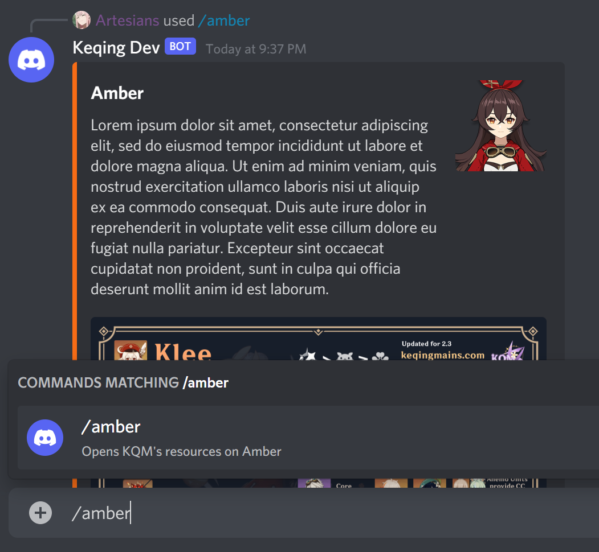

# Creating a Live Command


**Live Command:** A custom command that can be utilized with the prefix "/" to link to a Live Interaction. There is a Discord limit of 100 commands.


## Tasukete Commands

**Tasukete** uses .yaml files to define commands. They can be used to execute JavaScript.

## Customization

A **Tasukete** admin can set the parameters that define the following:

* Live Interaction
* Description Text
* Permissions
  * Blacklist
  * Whitelist
* Channel Restrictions
  * Blacklist
  * Whitelist
* Ephemeral State


**Ephemeral State:** Boolean that defines whether or not other users can see the content generated by the command. By default, all commands are not ephemeral.


```yaml
interaction: characters/pyro/amber
description: "Opens KQM's resources on Amber"
channels:
  whitelist:
    - "channel id"
  blacklist:
    - "channel id"
ephemeral: true

```


