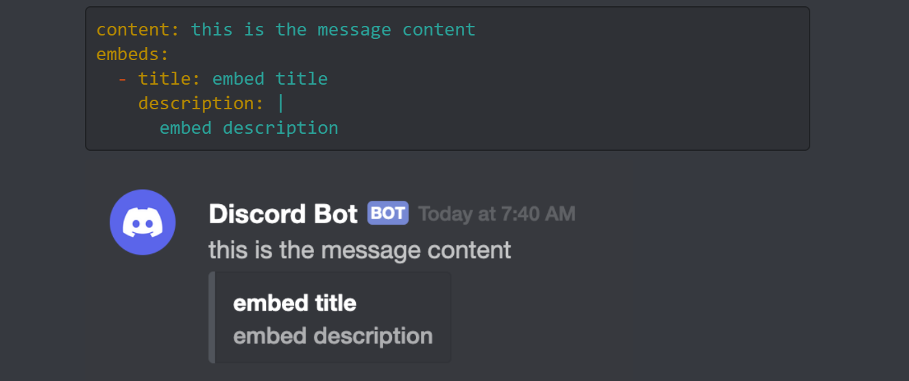
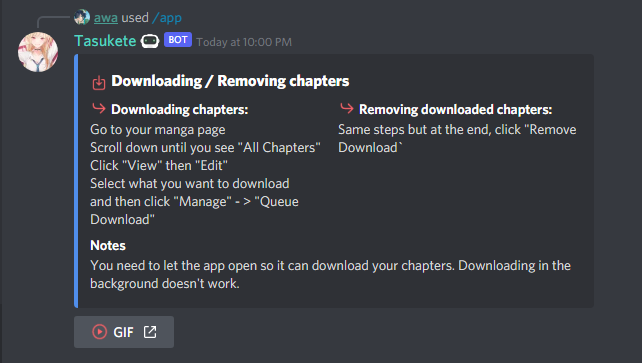

# Creating a Live Interaction


**Embed:** A message that can be customized to be sent by Tasukete. They can have a colored border, embedded images, text fields, and other fancy properties.




You can use an embed-visualizer to smoothen out the generation of embeds.

[https://faizandurrani.github.io/embed-visualizer/](https://faizandurrani.github.io/embed-visualizer/)

## Tasukete Interactions

**Tasukete** uses .yaml files to construct embeds that are built out of the interaction repo. These can be sent by Tasukete using LiveCommands and Triggers.


## Customization

Tasukete is able to generate embeds that can be interacted with by the user. Buttons and drop-down menus are able to be used to navigate to other Live Interactions. A Tasukete admin can set the parameters that define the following:

* Message text
* Embeds
  * Title
  * Description
  * Fields
  * Thumbnail
  * Image
  * Footer
* Buttons
  * Label
  * Emoji
  * Link
  * Style
* Permissions
  * Blacklist
  * Whitelist
* Dropdowns
  * Options

```yaml
embeds:
- color: 0x508DEB
  title: "**<:download:846436748024348703> Downloading / Removing chapters **"
  fields:
  - name: '<:next:846452869175050240> Downloading chapters:'
    value: |
      Go to your manga page
      Scroll down until you see "All Chapters" 
      Click "View" then "Edit"
      Select what you want to download 
      and then click "Manage" - > "Queue Download"
    inline: true
  - name: '<:next:846452869175050240> Removing downloaded chapters:'
    value: |
      Same steps but at the end, click "Remove Download`
    inline: true
  - name: 'Notes'
    value: |
      You need to let the app open so it can download your chapters. Downloading in the background doesn't work. 
    
buttons:
  - label: "GIF"
    customId: 
    style: LINK
    emoji: "<:play:846471522259304455>"
    url: "https://cdn.discordapp.com/attachments/794353299343933450/821848033994080366/download.gif"
    
permissions:
  whitelist:
    - "945455972183322674"
```

The code block above will generate an embed will display the following information.




To obtain emote ID's, use the "\\" prefix before an emote.

