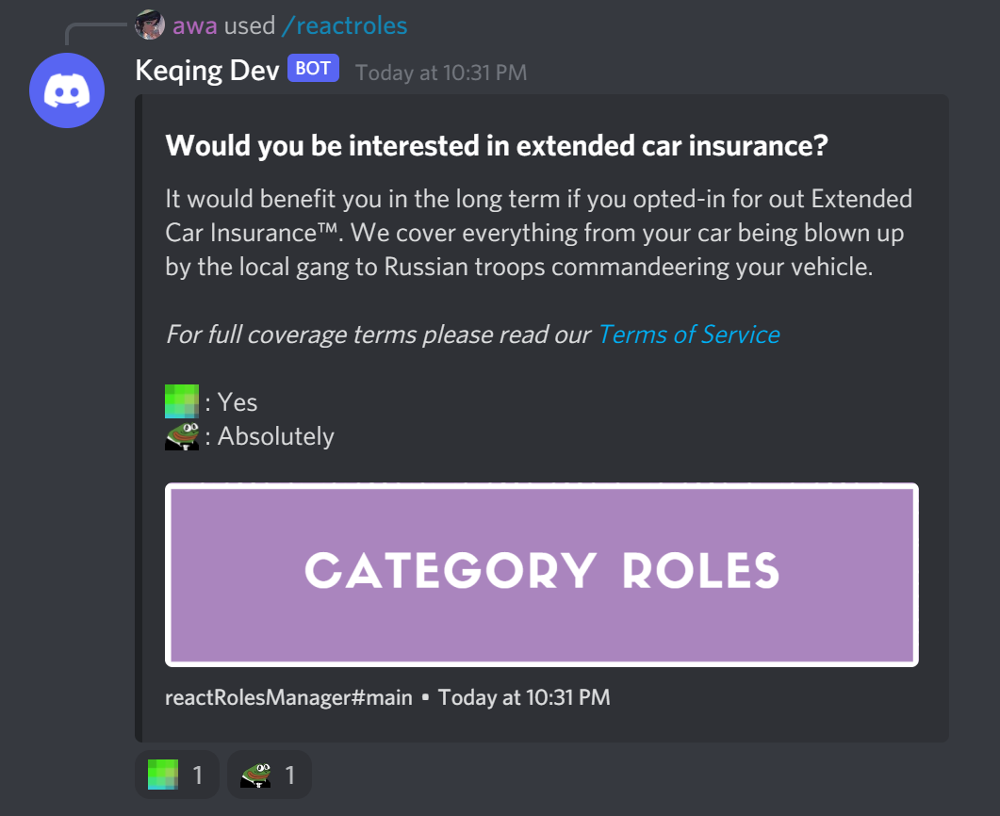

# Setting Up Reaction Roles


**Reaction Roles: Tasukete** can generate embeds that have configureable reactions that can give a user roles.


## Tasukete Commands

**Tasukete** uses the config.yaml file to configure all reaction embeds.

## Customization

A **Tasukete** admin can set the parameters that define the following:

* Active State
* Permissions
  * Blacklist
  * Whitelist
* Embeds
  * Title
  * Description
  * Fields
  * Thumbnail
  * Image
  * Footer
* Reactions
  * Emote
  * Role Given
  * Description

```yaml
  reactRoles:
    enabled: true
    
    # Who can use the /reactroles command, anyone with MANAGE_ROLES if not set.
    permissions:
      whitelist:
        - "${ ROLES.MODERATOR }"
    
    configs:
      main:
        image: "https://cdn.discordapp.com/attachments/810941835949244447/811264667867414558/unknown.png"
        title: "Would you be interested in extended car insurance?"
        description: |-
          It would benefit you in the long term if you opted-in for out Extended Car Insurance:tm:. We cover everything from your car being blown up by the local gang to Russian troops commandeering your vehicle.
          
          *For full coverage terms please read our [Terms of Service](https://www.youtube.com/watch?v=dQw4w9WgXcQ)*
      
        # Who can get these roles
        permissions:
          whitelist:
            - "${ ROLES.VERIFIED }"
          blacklist:
            - "${ ROLES.COFFINED }"
            
        reactions:
          # REACTION EMOJI ID: ROLE
          "pe:946999484175491102":
            role: "945554661413367819"
            description: "Yes"
            
          "based:945928754973270067":
            role: "945554661413367819"
            description: "Absolutely"
```


